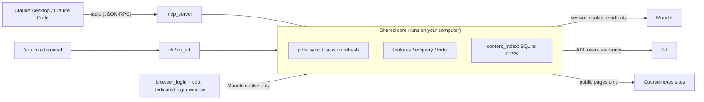

# Monash Study Kit

[](#two-parts-one-codebase)
[](#development)
[](https://github.com/Waldo0926/monash-study-kit/releases)
[](LICENSE)
[](#privacy-and-security)

[](https://github.com/Waldo0926/monash-study-kit/actions/workflows/test.yml) [](https://glama.ai/mcp/servers/Waldo0926/monash-study-kit)

**English** · [中文](README.zh-CN.md)

Connect Monash **Moodle** and **Ed** to Claude, then just ask Claude:

- "What's due this week?": Moodle deadlines, assignments you may have missed, unfinished Ed lessons, latest announcements
- "Anything new on Ed? Has anyone replied to my question?"
- "Which week of FIT2102 covered monads? Which slide deck, which page?"
- "What does the A2 spec ask for?", "What's my current grade in FIT2109?"

Everything stays **on your own computer**: course files, login state and the database live locally and never pass through a third-party server.
All tools are **read-only**: they never submit assignments, attempt quizzes or post on Ed.

Built for Monash Malaysia (times are handled as UTC+8); Australian campuses work too, see the [FAQ](#faq).

---

## Two parts, one codebase

The same core (login, sync, queries) serves two kinds of "users":

**MCP: the interface for Claude.** Moodle and Ed both sit behind Okta + MFA, so Claude cannot get in by itself.
The MCP server lets Claude look things up mid-conversation (tools such as `get_study_todo`, `search_content`, `list_ed_updates`):

- **Answers come from real data**: deadlines, announcements and grades are fetched live, with sources such as "Workshop 5 Slides, page 25".
- **Both platforms at once**: one "what do I need to do this week" checks Moodle deadlines, unfinished Ed lessons and announcements from both.
- **No manual copying**: no downloading PDFs and re-uploading them. Claude finds the right file and reads only the pages it needs, saving time and usage.
- **Natural follow-ups**: "What does the A2 spec require?" "Explain that week's functor material using the lecture notes."

**CLI (the `monash` command): the interface for humans.**

1. **Things only a person can do**: installation, passing MFA in the login window, pasting the Ed token (tokens should never go through a chat, so they are only entered in the terminal).
2. **No AI needed**: out of usage or just want a quick look? `monash todo` answers in a second (see [Works without Claude usage](#works-without-claude-usage)).
3. **Troubleshooting and maintenance**: `status`, `sync`, `update`, `uninstall`.

In short: MCP turns Claude into a TA who knows your units; the CLI handles setup, login and fallback. Ask in Claude day to day, open the terminal occasionally.

## Requirements

- **Claude Desktop** ([download](https://claude.ai/download)) or **Claude Code**
- **Chrome, Edge or Brave** (the Edge that ships with Windows is fine), used to log in to Moodle
- A Monash account

## Installation

### macOS

Open Terminal (search "Terminal" in Launchpad) and run these one at a time:

```bash
curl -LsSf https://astral.sh/uv/install.sh | sh
```

After it finishes, **close Terminal and open it again**, then:

```bash
uv tool install https://github.com/Waldo0926/monash-study-kit/archive/refs/heads/main.zip
```

```bash
monash setup
```

### Windows

Open PowerShell (search "PowerShell" in the Start menu) and run these one at a time:

```powershell
powershell -ExecutionPolicy ByPass -c "irm https://astral.sh/uv/install.ps1 | iex"
```

After it finishes, **close PowerShell and open it again**, then:

```powershell
uv tool install https://github.com/Waldo0926/monash-study-kit/archive/refs/heads/main.zip
```

```powershell
monash setup
```

> `uv` is a Python tool manager. It sets up Python for you, so you don't need to install Python yourself.

## First-time setup (`monash setup`)

Follow the prompts. There are four steps:

1. **Ed**: opens Ed's [API token page](https://edstem.org/au/settings/api-tokens). Click **Create Token**, name it anything,
   copy the token and paste it back into the terminal (nothing is shown while pasting; that's normal). The token doesn't expire; delete it on the same page whenever you want to revoke it.
2. **Moodle**: opens a **separate browser window**. Log in to Monash as usual (Okta + MFA). The window closes automatically once you're in.
   This window has its own profile and is completely isolated from your everyday browser: the tool only takes the Moodle session from this window
   and never reads anything from your normal browser.
3. **Units**: tracks this semester's units by default, or pick your own.
4. **Connect to Claude**: adds `monash` to Claude Desktop and Claude Code automatically.
   - On macOS it quits Claude Desktop first (Claude overwrites config edits made while it is running), then reopens it.
   - On Windows it asks you to **fully quit** Claude Desktop first: tray icon at the bottom right → right-click → Quit.

At the end you can choose to sync right away. The first sync downloads all course files and takes a few minutes to around a quarter of an hour.

Then open Claude Desktop: under **"+" → Connectors** in the chat box you'll see **monash**. Leave it switched on.

## Everyday use

Just ask in Claude. While Claude is open, the tool works in the background:

- syncs Ed and Moodle every hour (new posts, replies, course files) and refreshes the full-text index;
- refreshes the Moodle session every 20 minutes (Moodle logs you out after 4 idle hours).

### Not sure what to ask?

Use your own words: Claude picks tools by meaning, not keywords, so both "anything due this week" and "did I forget to submit something" reach the to-do tool.
To see everything it can do:

- Ask Claude "what can you do", or choose one of monash's preset prompts from the **"+" menu**: feature overview, this week's to-dos,
  Ed updates, find a topic, quiz review, grades and feedback. Presets are only sent when you click them, so they cost nothing otherwise.
- Run `monash help` in the terminal: every feature with an example question and the matching command.

### When the Moodle login expires

After shutdown or a long sleep, the Moodle session expires. Claude will tell you and ask whether to log in.
If you agree, it opens the login window on your computer; if Okta still remembers you, it logs in silently without even showing the window.
You can also run it yourself:

```bash
monash login
```

While the login is expired, **deadlines still work** (they come from Moodle's calendar subscription link, which needs no login), and Ed features are unaffected.

### Works without Claude usage

The CLI doesn't use AI and consumes no usage. Run `monash sync` first, then:

| I want to know | Command |
|---|---|
| What to do this week | `monash todo` |
| Deadlines | `monash due` (or `monash due FIT2102`) |
| Which file / page covers a topic | `monash grep "git rebase"` |
| New Ed posts and replies | `monash ed new` |
| Replies to my own posts | `monash ed following` |
| Read a full post | `monash ed show FIT2102#42` |
| Grades / possibly missed assignments | `monash moodle grades FIT2102` / `monash moodle assignments --missing` |

The difference is that nobody summarises for you; you get the raw information. Background sync and Moodle session refresh run alongside Claude Desktop:
while Claude is open they keep running even if your usage is exhausted; if Claude is closed, run `monash sync` before querying and `monash login` if Moodle has expired.

## Other AI clients

MCP is an open protocol and `monash mcp` is a standard local (stdio) MCP server, so any client that supports local MCP servers should in principle work.
`monash setup` only configures Claude Desktop and Claude Code automatically; the clients below need manual configuration.

> ⚠️ **None of the clients below have been tested.** The configuration follows each vendor's official docs (as of 2026-09); the official docs take precedence.
> Only **Claude Desktop** and **Claude Code** have been tested.

**Step 1: find the full path of the `monash` program** (many clients don't inherit your terminal's PATH, so a full path is safer)

- macOS: run `which monash`, usually `/Users/<you>/.local/bin/monash`
- Windows: run `(Get-Command monash).Source` in PowerShell, usually `C:\Users\<you>\.local\bin\monash.exe`

Replace `/full/path/monash` in the examples with your path. **In JSON, Windows backslashes must be doubled**
(`C:\\Users\\...`); in TOML, use single quotes (`'C:\Users\...'`).

**Step 2: configure your client**

| Client | Config location | Status |
|---|---|---|
| Codex CLI / Codex in the ChatGPT desktop app / Codex IDE extension | `~/.codex/config.toml` (shared by all three) | Untested |
| Cursor | `~/.cursor/mcp.json` | Untested |
| VS Code (Copilot) | Command Palette → `MCP: Open User Configuration` | Untested |
| Gemini CLI | `~/.gemini/settings.json` | Untested |
| ChatGPT web / mobile app | n/a | **Not supported**: only remote servers, cannot reach a program on your computer |

Codex (`~/.codex/config.toml`), or simply run `codex mcp add monash -- /full/path/monash mcp`:

```toml
[mcp_servers.monash]
command = "/full/path/monash"
args = ["mcp"]
```

Cursor (`~/.cursor/mcp.json`) and Gemini CLI (`~/.gemini/settings.json`) use the same format:

```json
{
  "mcpServers": {
    "monash": { "command": "/full/path/monash", "args": ["mcp"] }
  }
}
```

VS Code (`mcp.json`; note the outer key is `servers`, not `mcpServers`):

```json
{
  "servers": {
    "monash": { "command": "/full/path/monash", "args": ["mcp"] }
  }
}
```

If the file already lists other servers, add the `monash` entry rather than overwriting the whole file. Restart the client afterwards.

**Notes**:

- Login and unit selection are still done with `monash setup`. Without Claude installed, the last step reports "Claude Desktop not found"; just ignore it.
- Background sync and Moodle session refresh only run while the client is open and the MCP server is running.
- Tool descriptions are written with Claude in mind. Other models usually follow them fine, but this hasn't been verified.
- If you'd rather not bother, the CLI works with no AI at all (see [Works without Claude usage](#works-without-claude-usage)); you can paste the output of `monash todo` and friends into any AI.

### What can be searched

`monash grep` and Claude's course-material search cover:

- Moodle course files (PDF, Word, PowerPoint, text and code)
- PDFs in Ed Lessons, plus content pages written directly in Ed
- **Course-notes websites**: many units publish notes on a lecturer's public site, e.g. tgdwyer.github.io for FIT2102 or
  yqtian-se.github.io for FIT2109. Pages of this kind linked from Moodle or Ed are fetched, converted to text and stored in the
  `Course notes (web)` folder of your course files. Only pages the unit links to directly are fetched (no site-wide crawling), and each page is re-fetched at most once a week.
  University websites, videos, Google Docs and similar are skipped. To turn it off: `monash config web_notes false`
- Lecture-recording transcripts (only with the `[media]` extra installed)

## Privacy and security

- **Where data lives**:
  - macOS: `~/Library/Application Support/monash-study-kit`
  - Windows: `%LOCALAPPDATA%\monash-study-kit`

  It contains course files (`files`), the database (`data`), login credentials (`secrets`, readable only by your own user account) and the dedicated login window's profile (`browser-profile`).
  Run `monash open` to open the course-files folder.
- **Stored credentials**: the Moodle session cookie, the Ed API token and the Moodle calendar subscription link. They stay on your computer and are only used to talk to Moodle / Ed.
  **Never send the `secrets` folder to anyone.**
- **What Claude can see**: only what a tool returns when you ask something (e.g. a list of deadlines, the full text of a post, the text of a course file).
  Tokens and cookies are never sent to Claude. **Don't paste your Ed token into a chat either**; it is only entered in the terminal.
- **What it does to Moodle / Ed**: read-only. Requests are spaced out, so it never hammers university systems like a crawler.
- **Complete removal**:

  ```bash
  monash uninstall
  uv tool uninstall monash-study-kit
  ```

  `monash uninstall` removes it from Claude and asks whether to delete all data. Finally, delete the token on Ed's settings page.

## Command reference

You can also query directly in the terminal without Claude:

| Command | What it does |
|---|---|
| `monash status` | Login status, last sync time |
| `monash help` | Everything it can do, each with an example question and the matching command |
| `monash doctor` | Health check when something breaks: checks each item and tells you how to fix it; send the whole output to whoever helps you |
| `monash todo` | This week: deadlines, possibly missed work, unfinished Ed lessons, announcements, unread replies |
| `monash due [FIT2102]` | Deadlines |
| `monash grep "monad" [FIT2102]` | Full-text search over course files, course-notes sites, Ed lesson pages and recording transcripts (with page numbers / timestamps) |
| `monash sync` | Sync now |
| `monash login` / `monash login ed` | Log in to Moodle / replace the Ed token |
| `monash courses` | Re-pick tracked units |
| `monash open` | Open the course-files folder |
| `monash moodle grades [FIT2102]` | Grades and feedback |
| `monash moodle assignments --missing` | Possibly missed assignments |
| `monash moodle news` / `find` / `get` / `messages` / `calendar` | Announcements / find an activity / download one file / messages / calendar subscription link |
| `monash ed new` / `following` / `search` / `show FIT2102#42` | Ed updates / new replies to my posts / search / read a post |
| `monash ed lessons FIT2109` / `quiz FIT2109` | Ed lesson progress / quiz questions (for revision) |
| `monash ed read FIT2109 "W3 Pre-Class"` | A whole lesson as Markdown: text slides, reading pages and PDFs in order, plus its quiz questions |
| `monash config` | View / change settings (restart Claude Desktop afterwards) |
| `monash update` | Update to the latest version |

Add `--json` for JSON output (output is JSON automatically when piped; `--text` forces text). Every command has `--help`.

Exit codes (for scripts): 0 success, 1 bad arguments, 2 login required (`monash login` / `monash login ed`),
3 cannot reach Moodle/Ed or the server returned an error, 4 unit or post not found, 130 interrupted with Ctrl-C.

## Lecture-recording transcripts (optional)

To let Claude know what was said in class, recordings can be turned into timestamped transcripts:

- **YouTube** links in Ed "Week N … Recording" posts: YouTube captions are fetched directly, which is fast;
- **Zoom** recordings: downloaded with the passcode from the post, then transcribed on your computer with Whisper (a two-hour lecture takes 20–30 minutes on an ordinary laptop).

These dependencies are large (about 1 GB) and not installed by default. To get them, reinstall with `[media]`:

```bash
uv tool install --reinstall "monash-study-kit[media] @ https://github.com/Waldo0926/monash-study-kit/archive/refs/heads/main.zip"
```

Then run it manually when needed (it never runs in the background, so it won't slow your computer down):

```bash
monash media
```

Videos uploaded directly to Moodle aren't downloaded by default either (often hundreds of MB); they are recorded as links. To download them: `monash config download_videos true`.

## Updating

```bash
monash update
```

Restart Claude Desktop afterwards. On Windows it tells you to quit Claude first and which command to run next (a running program can't be overwritten).

You'll be told when a new version is out: an extra line after terminal commands, and a short mention when you ask Claude for your to-dos. It checks GitHub at most once a day
and sends no personal information; to turn it off: `monash config update_check false`.

## FAQ

### monash doesn't show up in Claude

Run `monash setup claude` to reconnect. On Windows, **fully quit** Claude from the tray first.
If it still fails, check for errors under Claude Desktop → Settings → Developer.

### The login window won't open / "no browser found"

Install Chrome or Edge. If your browser lives somewhere unusual, point to it:
`monash config browser "C:\Program Files\...\chrome.exe"`. If an earlier dedicated login window is still open, close it first.

### "Path too long" when syncing course files on Windows

By default Windows limits full paths to 260 characters, and unit name + week name + file name can exceed that. Store course files somewhere shorter:
`monash config files_dir C:\Monash`, then `monash sync`.

### Australian campuses

Moodle shows times in your account's time zone; the default is Malaysia (UTC+8). For Australian campuses: `monash config tz_offset 10` (11 during daylight saving).

### Where are Ed "assignment deadlines"?

Most Ed lessons have no due date; Moodle is the source of truth for deadlines. The Ed-lesson part of `get_study_todo` follows your own progress
(it lists unfinished lessons up to the week after the one you've reached).

### Something is broken

Run `monash doctor` and follow the → after each item. If you need help, send the whole output; it contains no tokens, cookies or similar.
You can also just tell Claude "monash isn't working" and it will run the same checks. The MCP background log is `mcp.log` in the data directory.

## Development

```bash
uv sync
uv run pytest
uvx ruff check src tests
uv run monash --help
```

**Releasing**: whenever `src/` changes, bump `__version__` in `src/monash_study_kit/__init__.py` (patch for bug fixes,
minor for new features); the update notice compares against this number on main. The CI `version-bump` check blocks PRs that forget it. Note what changed in [`CHANGELOG.md`](CHANGELOG.md).

### How it fits together



| Module | What it does |
|---|---|
| `moodlelib`, `htmldom` | Moodle client (cookie session, AJAX calls, downloads that never send the cookie off-site) and a small HTML tree for page parsing |
| `syncer` | Mirrors each unit's Moodle files into `Unit/Week NN - Title/` folders |
| `features`, `todo` | Deadlines (with an iCal fallback when the session has expired), grades, assignments, announcements, the combined to-do list |
| `edlib`, `edsync`, `edquery` | Ed API client, incremental sync of posts and replies, local queries |
| `lessons`, `lesson_reader` | Ed Lessons: progress, slides, quiz questions, a whole lesson as Markdown |
| `content_index`, `textextract`, `webnotes` | Full-text search over PDFs, Office files, course-notes websites and transcripts |
| `browser_login`, `cdp` | Dedicated login window driven over the Chrome DevTools Protocol (a minimal WebSocket client in the standard library) |
| `jobs`, `mcp_server`, `cli` | Sync and keep-alive jobs, the MCP server, the command line |
| `doctor`, `help_menu`, `update_check`, `claude_setup` | Health check, help and preset prompts, new-version notice, adding the server to Claude |
| `recordings`, `transcribe` | Optional: lecture recordings to timestamped transcripts (`[media]` extra) |

The only runtime dependency is `pypdf`; everything else (HTTP, SQLite, WebSocket, HTML parsing) uses the standard library.
Tests run on macOS, Windows and Ubuntu with Python 3.10 and 3.13 in CI, and `ruff` checks for syntax errors, undefined names and unused imports.

## License

MIT. This is an independent student-built tool, not affiliated with Monash University, Ed or Anthropic.
