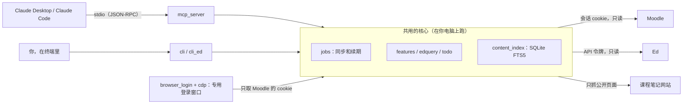

# Monash Study Kit · Monash 学习助手

[](#它由两部分组成)
[](#开发)
[](https://github.com/Waldo0926/monash-study-kit/releases)
[](LICENSE)
[](#隐私和安全)

[](https://github.com/Waldo0926/monash-study-kit/actions/workflows/test.yml) [](https://glama.ai/mcp/servers/Waldo0926/monash-study-kit)

[English](README.md) · **中文**

把 Monash 的 **Moodle** 和 **Ed** 接进 Claude，在 Claude 里直接问：

- “这周我有什么要交的？”：Moodle 截止日期、可能漏交的作业、Ed 上还没做的 lesson、最新公告
- “Ed 上有什么新消息？我上次问的问题有人回了吗？”
- “FIT2102 哪一周讲了 monad？在哪份讲义第几页？”
- “帮我看看 A2 的 spec 要求什么”、“我 FIT2109 现在成绩多少？”

所有东西都在**你自己的电脑上**：课件、登录状态、数据库都存在本机，不经过任何第三方服务器。工具全部是**只读**的：不会帮你交作业、做测验或在 Ed 上发帖。

适合 Monash 马来西亚校区（时间按 UTC+8 处理）；澳洲校区也能用，见[常见问题](#常见问题)。

---

## 它由两部分组成

同一套底层代码（登录、同步、查询），给两种“用户”用：

**MCP：给 Claude 用的接口。** Moodle 和 Ed 都要 Okta + MFA 登录，Claude 自己进不去。MCP 让 Claude 在聊天中途自己去查（`get_study_todo`、`search_content`、`list_ed_updates` 等工具）：

- **答案来自真实数据**：截止时间、公告、成绩都是当下查到的，还能给出处，比如“Workshop 5 Slides 第 25 页”。
- **两边合起来看**：一句“这周要做什么”，同时查 Moodle 截止、Ed 没做完的 lesson、两边的公告。
- **不用手动搬资料**：不用下载 PDF 再上传。Claude 按需找到那份课件、只读需要的几页，省事也省额度。
- **可以接着追问**：“A2 spec 要求什么？”“那周讲的 functor 结合讲义解释一下”。

**CLI（`monash` 命令）：给人用的接口。**

1. **只有人能做的事**：安装配置、在登录窗口里过 MFA、粘贴 Ed 令牌（令牌不该经过聊天，所以只在终端输入）。
2. **不依赖 AI**：没额度或只想快速看一眼时，`monash todo` 一秒出结果（见[没额度了也能用](#claude-没额度了也能用)）。
3. **排错和维护**：`status`、`sync`、`update`、`uninstall`。

简单说：MCP 让 Claude 变成懂你课程的助教，CLI 负责装好、登录和兜底。平时在 Claude 里问，偶尔用终端。

## 需要什么

- **Claude Desktop**（[下载](https://claude.ai/download)）或 **Claude Code**
- **Chrome、Edge 或 Brave** 其中一个（Windows 自带 Edge 就行），用来登录 Moodle
- Monash 账号

## 安装

### macOS

打开“终端”（启动台里搜 Terminal），一行一行粘贴运行：

```bash
curl -LsSf https://astral.sh/uv/install.sh | sh
```

装完**关掉终端再重新打开**，然后：

```bash
uv tool install https://github.com/Waldo0926/monash-study-kit/archive/refs/heads/main.zip
```

```bash
monash setup
```

### Windows

打开 PowerShell（开始菜单里搜 PowerShell），一行一行粘贴运行：

```powershell
powershell -ExecutionPolicy ByPass -c "irm https://astral.sh/uv/install.ps1 | iex"
```

装完**关掉 PowerShell 再重新打开**，然后：

```powershell
uv tool install https://github.com/Waldo0926/monash-study-kit/archive/refs/heads/main.zip
```

```powershell
monash setup
```

> `uv` 是一个 Python 工具管理器，会自动准备好 Python，不用自己装 Python。

## 第一次设置（`monash setup`）

跟着提示走，一共四步：

1. **Ed**：会帮你打开 Ed 的 [API 令牌页面](https://edstem.org/au/settings/api-tokens)。点 **Create Token**，名字随便写，把生成的令牌复制，粘贴回终端（粘贴时不显示，正常）。这个令牌不会过期，不想用了在同一个页面删掉就作废。
2. **Moodle**：会打开一个**单独的浏览器窗口**，在里面照常登录 Monash（Okta + MFA）。登录成功后窗口自动关闭。这个窗口有自己独立的配置，和你平时用的浏览器互不影响。工具只从这个窗口里拿 Moodle 的登录状态，不会去读你日常浏览器里的任何东西。
3. **选课**：默认跟踪本学期的课，也可以自己挑。
4. **接进 Claude**：自动把 `monash` 加进 Claude Desktop 和 Claude Code。
   - macOS 上会先帮你退出 Claude Desktop（开着的时候改配置会被它覆盖），改完再打开。
   - Windows 上会请你先**完全退出** Claude Desktop：右下角托盘里的 Claude 图标 → 右键 → Quit。

最后可以选择马上同步一次。第一次同步会下载所有课件，要几分钟到十几分钟。

完成后打开 Claude Desktop，在聊天输入框的 **“+” → Connectors** 里能看到 **monash**，开着就行。

## 平时怎么用

直接在 Claude 里问就行。Claude 开着的时候，工具会在后台：

- 每小时同步一次 Ed 和 Moodle（新帖、新回复、新课件），并更新全文索引；
- 每 20 分钟给 Moodle 续一次期（Moodle 空闲 4 小时就会把你登出）。

### 不知道能问什么

直接用自己的话问就行：Claude 按意思挑工具，不是靠关键词触发，“这周有啥要交的”和“我是不是漏交了什么”都能用到待办。想看都能做什么：

- 在 Claude 里问“你能做什么”，或者从输入框的 **“+” 菜单**里选 monash 的预设提示：功能大全、本周待办、Ed 新消息、找知识点、测验题复习、成绩和反馈。预设提示点了才发给 Claude，平时不占额度。
- 终端里运行 `monash help`：每项功能附一句示例问法和对应的命令。

### Moodle 登录过期了怎么办

电脑关机、睡眠久了，Moodle 会话会过期。这时 Claude 会告诉你，并问要不要登录，同意的话它会在你电脑上打开登录窗口；如果 Okta 还记得你，会在后台自动登录，连窗口都不用弹。也可以自己在终端运行：

```bash
monash login
```

登录过期期间，**截止日期照样能查**（用的是 Moodle 的日历订阅链接，不需要登录）；Ed 的功能完全不受影响。

### Claude 没额度了也能用

命令行工具不需要 AI，不耗任何额度。先 `monash sync` 同步一下，然后：

| 想知道 | 命令 |
|---|---|
| 这周要做什么 | `monash todo` |
| 截止日期 | `monash due`（或 `monash due FIT2102`） |
| 某个知识点在哪份课件/哪一页 | `monash grep "git rebase"` |
| Ed 上的新帖和新回复 | `monash ed new` |
| 我的帖子有没有人回 | `monash ed following` |
| 读某个帖子全文 | `monash ed show FIT2102#42` |
| 成绩 / 可能漏交的作业 | `monash moodle grades FIT2102` / `monash moodle assignments --missing` |

区别是没人帮你总结，只列出原始信息。另外，后台同步和 Moodle 续期是跟着 Claude Desktop 跑的：Claude 开着时，就算额度用完也照常进行；Claude 关掉的话，查之前先 `monash sync`，Moodle 过期了 `monash login`。

## 接入其他 AI 客户端

MCP 是开放协议，`monash mcp` 是标准的本地（stdio）MCP 服务器，所以支持本地 MCP 的客户端理论上都能接。`monash setup` 只会自动配置 Claude Desktop 和 Claude Code，下面这些要手动配置。

> ⚠️ **下面这些客户端都没有实际测试过**，配置格式照各家官方文档写（2026-09），以官方文档为准。测试过的只有 **Claude Desktop** 和 **Claude Code**。

**第 1 步：找到 `monash` 程序的完整路径**（很多客户端启动时读不到终端的 PATH，所以最好写完整路径）

- macOS：终端里运行 `which monash`，一般是 `/Users/你的用户名/.local/bin/monash`
- Windows：PowerShell 里运行 `(Get-Command monash).Source`，一般是 `C:\Users\你的用户名\.local\bin\monash.exe`

下面的例子里把 `/完整路径/monash` 换成你的路径。**Windows 路径写进 JSON 时，反斜杠要写两遍**（`C:\\Users\\...`）；写进 TOML 时用单引号（`'C:\Users\...'`）。

**第 2 步：按客户端配置**

| 客户端 | 配置位置 | 状态 |
|---|---|---|
| Codex CLI / ChatGPT 桌面 App 里的 Codex / Codex IDE 插件 | `~/.codex/config.toml`（三者共用） | 未测试 |
| Cursor | `~/.cursor/mcp.json` | 未测试 |
| VS Code（Copilot） | 命令面板 → `MCP: Open User Configuration` | 未测试 |
| Gemini CLI | `~/.gemini/settings.json` | 未测试 |
| ChatGPT 网页版 / 手机 App | 无 | **不支持**：只能接远程服务器，连不上你电脑上的程序 |

Codex（`~/.codex/config.toml`），或者直接运行 `codex mcp add monash -- /完整路径/monash mcp`：

```toml
[mcp_servers.monash]
command = "/完整路径/monash"
args = ["mcp"]
```

Cursor（`~/.cursor/mcp.json`）和 Gemini CLI（`~/.gemini/settings.json`），格式一样：

```json
{
  "mcpServers": {
    "monash": { "command": "/完整路径/monash", "args": ["mcp"] }
  }
}
```

VS Code（`mcp.json`，注意外层是 `servers` 不是 `mcpServers`）：

```json
{
  "servers": {
    "monash": { "command": "/完整路径/monash", "args": ["mcp"] }
  }
}
```

文件里已经有别的服务器的话，把 `monash` 那一项加进去就行，别把整个文件覆盖掉。改完重启客户端。

**注意**：

- 登录、选课还是用 `monash setup` 做。没装 Claude 的话，最后一步会提示“没找到 Claude Desktop”，忽略就行。
- 后台同步和 Moodle 续期只在客户端开着、MCP 在运行时进行。
- 工具说明是按 Claude 写的，别的模型一般也能照着用，但效果没验证过。
- 不想折腾的话，命令行本身跟任何 AI 都无关（见[没额度了也能用](#claude-没额度了也能用)），可以把 `monash todo` 之类的输出直接复制给任何 AI。

### 搜得到哪些内容

`monash grep` 和 Claude 里的课件搜索覆盖：

- Moodle 上的课件（PDF、Word、PowerPoint、文本和代码）
- Ed Lessons 里的 PDF，以及直接写在 Ed 里的正文页
- **课程笔记网页**：很多课的讲义在老师的公开网站上，比如 FIT2102 的 tgdwyer.github.io、FIT2109 的 yqtian-se.github.io。Moodle 和 Ed 里链接到的这类页面会被抓下来转成文字，存在课件文件夹的 `Course notes (web)` 里。只抓课程直接链接的页面，不会顺着链接整站爬；每页最多一周重抓一次。学校官网、视频、Google 文档之类不抓。不想要的话：`monash config web_notes false`
- 录播字幕稿（装了 `[media]` 才有）

## 隐私和安全

- **数据存在哪**：
  - macOS：`~/Library/Application Support/monash-study-kit`
  - Windows：`%LOCALAPPDATA%\monash-study-kit`

  里面有课件（`files`）、数据库（`data`）、登录凭据（`secrets`，只有你自己的账户能读）、专用登录窗口的配置（`browser-profile`）。运行 `monash open` 可以打开课件文件夹。
- **存了哪些凭据**：Moodle 的会话 cookie、Ed 的 API 令牌、Moodle 日历订阅链接。都只在你电脑上，只用来访问 Moodle / Ed 本身。**别把 `secrets` 文件夹发给别人。**
- **Claude 能看到什么**：只有你提问时 Claude 调用工具返回的内容（比如截止日期列表、某个帖子的全文、某份课件的文字）。令牌和 cookie 永远不会发给 Claude。**也不要把 Ed 令牌贴进聊天里**，令牌只在终端里输入。
- **会对 Moodle / Ed 做什么**：只读。请求之间有间隔，不会像爬虫一样猛打学校的系统。
- **彻底删除**：

  ```bash
  monash uninstall
  uv tool uninstall monash-study-kit
  ```

  `monash uninstall` 会把它从 Claude 里移除，并询问要不要删掉所有数据。最后记得去 Ed 设置页删掉令牌。

## 命令速查

不用 Claude 也可以直接在终端里查：

| 命令 | 作用 |
|---|---|
| `monash status` | 登录状态、上次同步时间 |
| `monash help` | 能做的事，每条附示例问法和对应命令 |
| `monash doctor` | 出问题时的体检：一项项查，告诉你怎么修；需要帮忙时把输出整段发给别人 |
| `monash todo` | 本周待办：截止、可能漏交、Ed 没做完的 lesson、公告、未读回复 |
| `monash due [FIT2102]` | 截止日期 |
| `monash grep "monad" [FIT2102]` | 全文搜课件、课程笔记网页、Ed Lessons 正文、录播字幕稿（带页码/时间戳） |
| `monash sync` | 立刻同步 |
| `monash login` / `monash login ed` | 登录 Moodle / 换 Ed 令牌 |
| `monash courses` | 重新选要跟踪的课 |
| `monash open` | 打开课件文件夹 |
| `monash moodle grades [FIT2102]` | 成绩和反馈 |
| `monash moodle assignments --missing` | 可能漏交的作业 |
| `monash moodle news` / `find` / `get` / `messages` / `calendar` | 公告 / 找活动 / 下载单个文件 / 站内信 / 日历订阅链接 |
| `monash ed new` / `following` / `search` / `show FIT2102#42` | Ed 新动态 / 我的帖子有没有新回复 / 搜索 / 读帖子 |
| `monash ed lessons FIT2109` / `quiz FIT2109` | Ed Lessons 进度 / 测验题（复习用） |
| `monash ed read FIT2109 "W3 Pre-Class"` | 整节 lesson 的正文：文字页、阅读网页、PDF 按页序拼成 Markdown，附测验题 |
| `monash config` | 看/改设置（改完重启 Claude Desktop） |
| `monash update` | 更新到最新版 |

加 `--json` 输出 JSON（输出被管道接走时自动是 JSON，`--text` 强制文本）。每个命令都有 `--help`。

退出码（写脚本时用）：0 成功，1 参数不对，2 需要登录（`monash login` / `monash login ed`），3 连不上 Moodle/Ed 或对方出错，4 找不到课程或帖子，130 被 Ctrl-C 中断。

## 录播字幕（可选）

想让 Claude 知道“老师上课讲了什么”，可以把录播转成带时间戳的字幕稿：

- Ed 上 “Week N … Recording” 帖子里的 **YouTube** 链接：直接取 YouTube 字幕，很快；
- **Zoom** 录像：用帖子里的 Passcode 下载，再在你电脑上用 Whisper 转写（普通笔记本上一节两小时的课要二三十分钟）。

这部分依赖比较大（约 1 GB），默认不装。想要的话重新安装时加上 `[media]`：

```bash
uv tool install --reinstall "monash-study-kit[media] @ https://github.com/Waldo0926/monash-study-kit/archive/refs/heads/main.zip"
```

然后需要的时候手动运行（不会在后台自动跑，免得拖慢电脑）：

```bash
monash media
```

Moodle 上直接挂的录像默认也不下载（动辄几百 MB），会记成链接。想下载：`monash config download_videos true`。

## 更新

```bash
monash update
```

更新后重启一下 Claude Desktop。Windows 上它会告诉你先退出 Claude、再运行哪条命令（正在运行的程序没法被覆盖）。

有新版本时会提醒你：终端里运行命令后多一行提示，Claude 里问待办时也会顺带说一句。每天最多查一次 GitHub，不带任何个人信息；不想要的话 `monash config update_check false`。

## 常见问题

### Claude 里看不到 monash

运行 `monash setup claude` 重新接一次。Windows 上一定要先从托盘**完全退出** Claude 再运行。还不行的话看 Claude Desktop → Settings → Developer 里有没有报错。

### 登录窗口打不开 / 提示没找到浏览器

装一个 Chrome 或 Edge。浏览器装在不常见的位置的话，指定一下：`monash config browser "C:\Program Files\...\chrome.exe"`。如果之前的专用窗口还开着，先把它关掉。

### Windows 上课件同步报“路径太长”

Windows 默认整条路径不能超过 260 个字符，课程名 + 周次名 + 文件名叠起来可能超。把课件放到短一点的地方：`monash config files_dir C:\Monash`，然后 `monash sync`。

### 澳洲校区

Moodle 页面上的时间按账号时区显示，默认按马来西亚（UTC+8）。澳洲校区：`monash config tz_offset 10`（夏令时 11）。

### Ed 的“作业截止时间”在哪

Ed 的 lesson 大多没有截止日期；作业截止以 Moodle 为准。`get_study_todo` 里 Ed lesson 部分是按你自己的进度列的（做到第几周，就列到下一周为止没完成的）。

### 出问题了

运行 `monash doctor`，照着每项后面的 → 去修。需要别人帮忙时把整段输出发过去，里面不含令牌、cookie 之类的东西。在 Claude 里也可以直接说“monash 用不了了”，它会跑同一套检查。MCP 的后台日志在数据目录的 `mcp.log`。

## 开发

```bash
uv sync
uv run pytest
uvx ruff check src tests
uv run monash --help
```

**发新版**：改了 `src/` 就把 `src/monash_study_kit/__init__.py` 里的 `__version__` 加一（修 bug 加最后一位，加功能加中间一位），朋友那边的更新提示比的就是 main 上的这个号。CI 的 `version-bump` 检查会拦住忘了改的 PR。改了什么记在 [`CHANGELOG.md`](CHANGELOG.md)。

### 整体结构



| 模块 | 作用 |
|---|---|
| `moodlelib`、`htmldom` | Moodle 客户端（会话 cookie、AJAX 接口、下载时 cookie 不会带到别的域名）和解析页面用的小型 HTML 树 |
| `syncer` | 把每门课的 Moodle 课件同步成 `课程/Week NN - 标题/` 的目录 |
| `features`、`todo` | 截止日期（会话过期时退回 iCal 订阅链接）、成绩、作业、公告、合在一起的待办清单 |
| `edlib`、`edsync`、`edquery` | Ed 接口客户端、帖子和回复的增量同步、本地查询 |
| `lessons`、`lesson_reader` | Ed Lessons：进度、课件、测验题、整节 lesson 转成 Markdown |
| `content_index`、`textextract`、`webnotes` | 全文搜索：PDF、Office 文件、课程笔记网页、录播字幕稿 |
| `browser_login`、`cdp` | 专用登录窗口，用 Chrome DevTools 协议控制（自己用标准库写的最小 WebSocket 客户端） |
| `jobs`、`mcp_server`、`cli` | 同步和续期任务、MCP 服务器、命令行 |
| `doctor`、`help_menu`、`update_check`、`claude_setup` | 体检、帮助和预设提示、新版本提示、接进 Claude |
| `recordings`、`transcribe` | 可选：录播转带时间戳的字幕稿（`[media]`） |

运行时只依赖 `pypdf`，HTTP、SQLite、WebSocket、HTML 解析都用标准库。CI 在 macOS、Windows、Ubuntu 上用 Python 3.10 和 3.13 跑测试，另外用 `ruff` 查语法错误、未定义的名字和没用的 import。

## 许可

MIT。这是学生自己做的工具，和 Monash University、Ed 或 Anthropic 没有关系。
